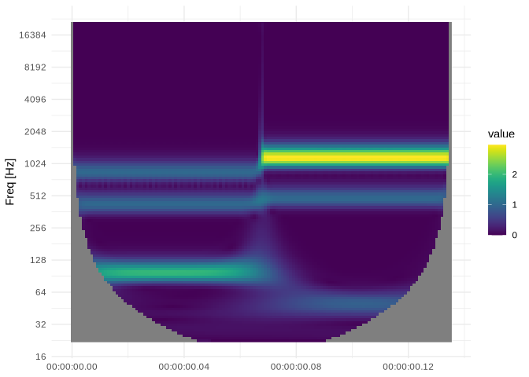

<!-- README.md is generated from README.Rmd. Please edit that file -->

# fcwtr

<!-- badges: start -->

[](https://github.com/lschneiderbauer/fcwtr/actions/workflows/R-CMD-check.yaml)
<!-- badges: end -->

The R package fcwtr is a simple wrapper invoking the [fcwt
library](https://github.com/fastlib/fCWT), a library implementing a
[continuous wavelet
transform](https://en.wikipedia.org/wiki/Continuous_wavelet_transform)
with a Morlet wavelet, utilizing the power of
[fftw](https://www.fftw.org/), a fast fourier transform implementation.

## Runtime Dependencies

-   R \>= 4.1 (due to the use of native pipes)
-   [fftw](https://www.fftw.org/) library (used by fcwt)

## Installation

You can install the development version of fcwtr like so (requiring
installed [devtools](https://devtools.r-lib.org/) package):

``` r
devtools::install_github("lschneiderbauer/fcwtr")
```

## Example

This is a basic example which shows how to invoke the fcwt library to
calculate the continuous wavelet transform and plot the result.

``` r
library(fcwtr)

# You are given some signal encoded in a numeric vector.
# In this example we use some superimposed sin signals.
input <- ts_sin_superpos

# One possibility is to use the fcwt library (almost) directly through
# a thin wrapper:
output <- fcwt(input)

# In this case the result is a rank 3 tensor,
# which can be used for further processing.
# No additional sugar is provided here.
dim(output)
#> [1]    2 6000   96
```

``` r
# A little more convenience is provided by `fcwt_df` which returns
# a data frame, already establishes a connection to physical units, and
# allows for pooling, and other small quality-of-live improvements:
df <- fcwt_df(
  ts_sin_superpos,
  sampling_rate = 44100,
  time_resolution = 0.001
)

df
#> # A tibble: 16,320 × 4
#>    time_ind  time   freq value
#>       <dbl> <dbl>  <dbl> <dbl>
#>  1        0     0 21185.    NA
#>  2        0     0 20000.    NA
#>  3        0     0 18881.    NA
#>  4        0     0 17824.    NA
#>  5        0     0 16827.    NA
#>  6        0     0 15886.    NA
#>  7        0     0 14997.    NA
#>  8        0     0 14158.    NA
#>  9        0     0 13366.    NA
#> 10        0     0 12618.    NA
#> # … with 16,310 more rows

# This data frame can be directly plotted.
plot(df)
```



``` r
# For long sequences, the required memory can exceed your local memory. In this
# case it can be useful to reduce the time resolution of the result and process
# the data in batches. This can be done with `fcwt_bulk_df`.
# In case the batch size is not explicitly provided, some heuristics are used to
# determine a batch size automatically:
bulk_df <- fcwt_bulk_df(
  rep(ts_sin_sin, 10),
  sampling_rate = 44100,
  time_resolution = 0.01,
  nsuboctaves = 24L,
  sigma = 4
)
#> ℹ Batch Size: 1048576 (~ Output Size: 2.01 GB)
#> Start batch process ...

plot(bulk_df)
```


<!-- regenerate with devtools::build_readme() -->
