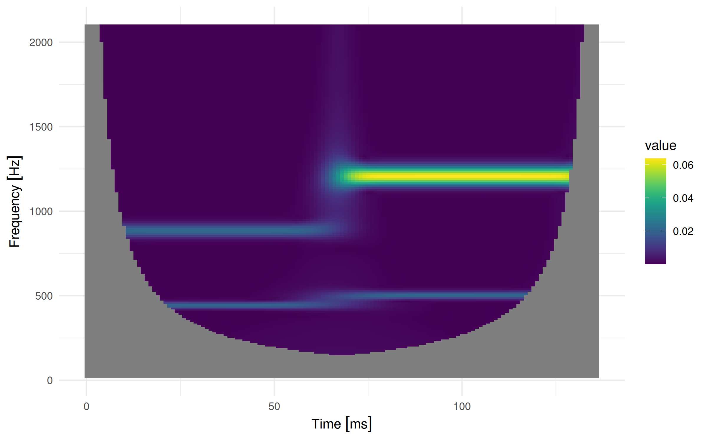
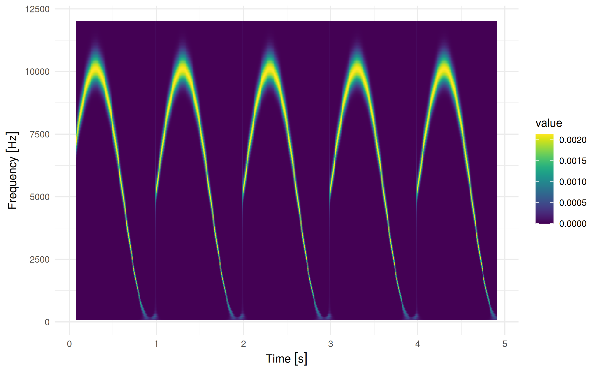

<!-- README.md is generated from README.Rmd. Please edit that file -->

# fCWTr <a href="https://lschneiderbauer.github.io/fCWTr/"></a>

<!-- badges: start -->

[](https://github.com/lschneiderbauer/fCWTr/actions/workflows/R-CMD-check.yaml)
[](https://lifecycle.r-lib.org/articles/stages.html#experimental)
[](https://CRAN.R-project.org/package=fCWTr)
[](https://app.codecov.io/gh/lschneiderbauer/fcwtr?branch=master)

<!-- badges: end -->

The R package fCWTr wraps the [fCWT
library](https://github.com/fastlib/fCWT), a library implementing a
[continuous wavelet
transform](https://en.wikipedia.org/wiki/Continuous_wavelet_transform)
with a Morlet wavelet, utilizing the power of
[fftw](https://www.fftw.org/), a fast fourier transform implementation.
It provides an R-like functional interface and implements common S3
methods for convenience.

See the original paper by Arts, L.P.A., van den Broek, E.L. The fast
continuous wavelet transformation (fCWT) for real-time, high-quality,
noise-resistant time–frequency analysis. Nat Comput Sci 2, 47–58 (2022).
<https://doi.org/10.1038/s43588-021-00183-z>

## System dependencies

- R \>= 4.1
- [fftw](https://www.fftw.org/) library with [single-precision
  support](https://www.fftw.org/faq/section2.html#singleprec) enabled
  (used by [fCWT](https://github.com/fastlib/fCWT))
- Optional: a CPU/compiler supporting the
  [AVX](https://en.wikipedia.org/wiki/Advanced_Vector_Extensions)
  instruction set
- Optional: OpenMP (and fftw built with [OpenMP
  support](https://www.fftw.org/doc/Usage-of-Multi_002dthreaded-FFTW.html))
  - On Windows, OpenMP support is disabled since rtools decided to
    compile fftw without OpenMP support.
  - On Linux and MacOS the build scripts should automatically detect
    whether OpenMP support is available.

By default, most compiler setups do not make use of AVX to increase
portability of the binary. If you are an R user that has a CPU
supporting AVX and want to make use of it, you might need to manually
enable compiler flags to let R know about it, and install the package
from source (so that it gets compiled on your machine). One way to
enable the flags is to create a file `~/.R/Makevars` with the following
content:

``` bash
CPPFLAGS = -mavx
CXXFLAGS = -mavx
```

## Installation

You can install the latest CRAN release of fCWTr with:

``` r
install.packages("fCWTr")
```

Alternatively, you can install the development version of fCWTr like so
(requiring installed [devtools](https://devtools.r-lib.org/) package):

``` r
devtools::install_github("lschneiderbauer/fCWTr")
```

Note that the installation process might fail if the package needs to be
compiled from source and system requirements are not satisfied. The
error message should give you hints, however, on what’s missing on your
system.

- Common confusion: fftw is installed, but compiled without single
  precision support. Please consult [fftw.org](fftw.org) for help.

## Example

This is a basic example that invokes the fCWT library to calculate the
continuous wavelet transform and plot the result.

``` r
library(fCWTr)

# A signal encoded in a numeric vector.
# In this example we use some superimposed sin signals.
signal <- ts_sin_superpos

output <-
  fcwt(
    signal,
    x_sample_freq = u(44.1, "kHz"),
    sigma = 5,
    y_sample_freq = u(1, "kHz"),
    freq_begin = u(16, "Hz"),
    freq_end = u(2100, "Hz"),
    n_freqs = 200,
    freq_scale = "linear"
  )

# The result is basically a numeric matrix with time and frequency dimension
dim(output)
#> [1] 137 200

# Some meta data is recorded too
output
#> _Scalogram_
#> * (Time/Frequency) dimension:  ( 137 , 200 )
#> * Sampling rate: 1 [kHz]
#> * Frequency scale: 16 [Hz] - 2100 [Hz], linear
#> * Time offset: 0 [s] 
#> * Sigma: 5
#>   o Time resolution at  16 [Hz] :  1.25 [1/Hz] 
#>   o Time resolution at  2100 [Hz] :  0.00952381 [1/Hz] 
#>   o Relative frequency resolution:  0.127324 
#> * Time/frequency matrix summary
#>    Min. 1st Qu.  Median    Mean 3rd Qu.    Max.    NA's 
#>   0.000   0.000   0.000   0.003   0.001   0.064    6671
```

The result can be converted into a data frame if need be:

``` r
head(as.data.frame(output), 10)
#>    time_index      time      freq        value
#> 1           0 0.000 [s] 2100 [Hz]           NA
#> 2           1 0.001 [s] 2100 [Hz]           NA
#> 3           2 0.002 [s] 2100 [Hz]           NA
#> 4           3 0.003 [s] 2100 [Hz]           NA
#> 5           4 0.004 [s] 2100 [Hz] 5.170488e-05
#> 6           5 0.005 [s] 2100 [Hz] 2.023599e-05
#> 7           6 0.006 [s] 2100 [Hz] 7.007858e-06
#> 8           7 0.007 [s] 2100 [Hz] 2.413503e-06
#> 9           8 0.008 [s] 2100 [Hz] 1.058135e-06
#> 10          9 0.009 [s] 2100 [Hz] 6.853825e-07
```

We can also directly plot the resulting scalogram:

``` r
plot(output, time_unit = "ms")
```



For long sequences, the required memory can exceed your available local
memory. In this case it can be useful to reduce the time resolution of
the result and process the data in batches. This can be done with
`fcwt_batch()`. In case the batch size is not explicitly provided, some
heuristics are used to determine a batch size automatically:

``` r
batch_result <-
  fcwt_batch(
    rep(ts_sin_sin, 5),
    x_sample_freq = u(44.1, "kHz"),
    y_sample_freq = u(100, "Hz"),
    freq_begin = u(100, "Hz"),
    freq_end = u(12, "kHz"),
    n_freqs = 200,
    freq_scale = "linear",
    sigma = 4
  )

plot(batch_result)
```



<!-- regenerate with devtools::build_readme() -->
